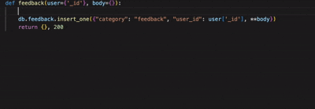

# inline-doctool README

Provides a way to conveniently associate documentation between files.
For example, the database schema defined in a Typescript file can be linked-to
via comments in Javascript and Python files.

## Features

- Insert `@idoc path` anywhere to create a CodeLens link to the file located at `path` (relative to the current file)
- Insert `@idoc /path` anywhere to link to the file located at `path` (relative to the project root)
- Insert `@idoc path:keyword` or `@idoc /path:keyword` anywhere to link to the first occurence of `keyword` in the file at `path`

## Requirements

No explicit requirements

## Extension Settings

No configurable settings

## Known Issues

No known issues

## Release Notes

First release

### 1.0.0

Initial release of linking features

---
